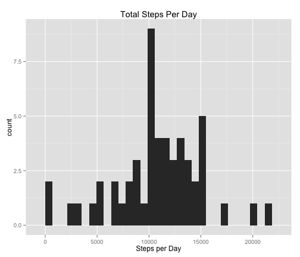
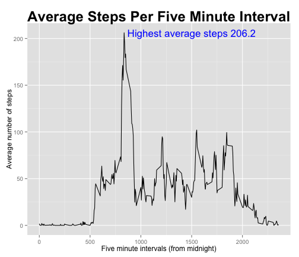
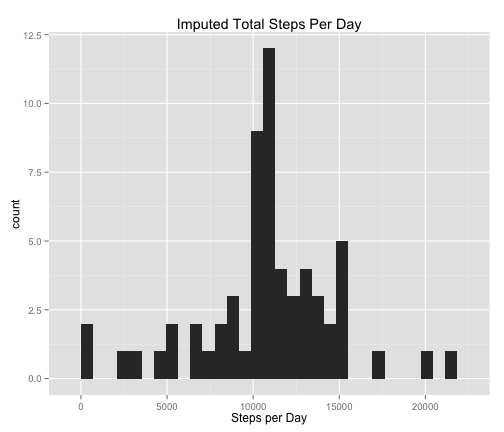
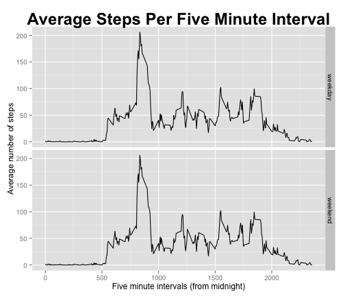

Assignment One
===============

```r
setwd("~/Desktop/Peng")
#setwd("~/Peng")
require(ggplot2)
```

```
## Loading required package: ggplot2
```

```r
activity<-read.csv("activity.csv",stringsAsFactors=FALSE)
#str(activity)
#summary(activity)
```


```r
#What are mean total number of steps taken per day? Produce a histogram.
#1.  Remove rows with missing data
#2.  Need to convert the dates into unique days.  
#3.  Get the sums for each day.  
#4.  Plot sums in histogram
#5.  Get mean and median
actComplete<-na.omit(activity)
actComplete$date<-as.factor(as.character(actComplete$date))
ndays<-nlevels(actComplete$date)
actComplete$daynum<-rep(NA,NROW(actComplete))
stepsDay<-rep(NA,ndays)
for (ii in 1:ndays) {
    tmp<-which(actComplete$date==levels(actComplete$date)[ii])
    actComplete$daynum[tmp]=ii
    stepsDay[ii]<-sum(actComplete$steps[tmp])
}
meanStepsDay<-mean(stepsDay)
medianStepsDay<-median(stepsDay)
text1<-sprintf("%.2f",meanStepsDay)
text2<-sprintf("%.2f",medianStepsDay)
```

```r
#1. Make a time series plot (i.e. type = "l") of the 5-minute interval (x-axis) and the average number of steps taken, averaged across all days (y-axis).  
#2.   Which 5-minute interval, on average across all the days in the dataset, contains the maximum number of steps?
#Make interval an ordered factor
intervalFactor<-factor(activity$interval,ordered=TRUE)
#Use by() to get means, need na.rm=TRUE
intervalMean<-by(activity$steps,intervalFactor,mean,na.rm=TRUE)
# create data.frame for plot
plotMean<-data.frame(interval=as.numeric(names(intervalMean)),
                     stepsAverage=as.numeric(intervalMean))
#Find interval with highest number of steps
maxAveSteps<-plotMean[which.max(plotMean$stepsAverage),]
text3<-sprintf("%i",as.integer(maxAveSteps[1]))
text4<-sprintf("%.1f",as.numeric(maxAveSteps[2]))
```

  
 
  
 
  


```r
#1. Calculate and report the total number of missing values in the dataset  
#2. Devise a strategy for filling in all of the missing values in the dataset.  
#3. Create a new dataset that is equal to the original dataset but with the missing data filled in.  
#4.    Make a histogram of the total number of steps taken each day and Calculate and report the mean and median total number of steps taken per day. Do these values differ from the estimates from the first part of the assignment? What is the impact of imputing missing data on the estimates of the total daily number of steps?  
#The summary() shows only steps have missing values.  
#Imputation will consist of replacing NA with mean of the five minute interval.
#activity2 will be the dataset with imputed values
activity2<-activity
# Loop through plotMean to get intervals, check activity2 for missing, and replace
for (ii in 1:NROW(plotMean)) {
    tmp<-which(is.na(activity2$steps) & activity2$interval==plotMean[ii,1])
    activity2[tmp,1]<-plotMean[ii,2]
}
#summary(activity2)
activity2$date<-as.factor(as.character(activity2$date))
ndays<-nlevels(activity2$date)
activity2$daynum<-rep(NA,NROW(activity2))
stepsDay2<-rep(NA,ndays)
for (ii in 1:ndays) {
    tmp<-which(activity2$date==levels(activity2$date)[ii])
    activity2$daynum[tmp]=ii
    stepsDay2[ii]<-sum(activity2$steps[tmp])
}
text5<-sprintf("%.2f",mean(stepsDay2))
text6<-sprintf("%.2f",median(stepsDay2))
```


```r
#Create a new factor variable in the dataset with two levels - "weekday" and "weekend" indicating whether a given date is a weekday or weekend day.
#Make a panel plot containing a time series plot (i.e. type = "l") of the 5-minute interval (x-axis) and the average number of steps taken, averaged across all weekday days or weekend days (y-axis).
days<-weekdays(as.Date(activity2$date))
activity2$week<-rep("weekday",NROW(activity2))
tmp<-which(days=="Saturday" | days=="Sunday")
activity2$week[tmp]<-"weekend"
activity2$week<-as.factor(activity2$week)
#Make interval an ordered factor
intervalFactor2<-factor(activity2$interval,ordered=TRUE)
#Use by() to get means, need na.rm=TRUE
intervalMean2<-by(activity2$steps,intervalFactor2,mean,na.rm=TRUE)
# create data.frame for plot
plotMean2<-data.frame(interval=as.numeric(names(intervalMean2)),
                     stepsAverage=as.numeric(intervalMean2),
                     week=activity2$week)
```
  
  
Mean number of total steps per day is 10766.19.  

The median total number of steps per day is 10765.00.


```r
bw<-(max(stepsDay)-min(stepsDay))/30
qplot(stepsDay,data=as.data.frame(stepsDay),geom="histogram",
      xlab="Steps per Day",main="Total Steps Per Day",binwidth=bw)
```

 
  
The interval starting at 835 has the highest average steps at 206.2.

  
  
  ```r
  ggplot(data=plotMean,aes(x=plotMean$interval,y=plotMean$stepsAverage)) +
  geom_line(groups=1) + labs(x="Five minute intervals (from midnight)",
                             y="Average number of steps") +
  labs(title="Average Steps Per Five Minute Interval") +
    theme(plot.title=element_text(face="bold",size=rel(2))) +
    annotate("text",x=1500,y=206,label="Highest average steps 206.2",
             size=6,colour="blue")
  ```
  
   
  
  
Imputed Mean Total Number of Steps Per is 10766.19.  
  
Imputed Median Total Number of Steps per Day is 10766.19.  

The mean and median of imputed data are very close to mean and median of the cases with no missing values.  

```r
bw<-(max(stepsDay2)-min(stepsDay2))/30
qplot(stepsDay2,data=as.data.frame(stepsDay2),geom="histogram",
      xlab="Steps per Day",main="Imputed Total Steps Per Day",binwidth=bw)
```

 
  
  
  ```r
  ggplot(data=plotMean2,aes(x=interval,y=stepsAverage)) +
    facet_grid(week ~ .) + 
    geom_line(groups=1) + labs(x="Five minute intervals (from midnight)",
                             y="Average number of steps") +
    labs(title="Average Steps Per Five Minute Interval") +
    theme(plot.title=element_text(face="bold",size=rel(2)))
  ```
  
   
  
